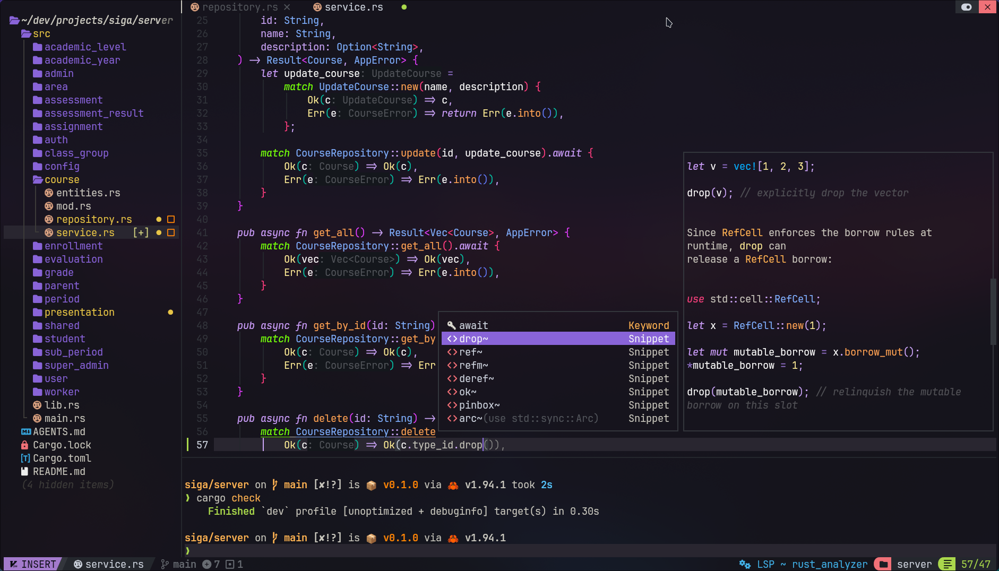

# Config for NvChad

This a custom config for NvChad, a Neovim GUI for Neovim written in Lua.




## 1. NvChad Installation

For install NvChad follow this [NvChad Instalation](https://nvchad.com/docs/quickstart/install)

and open nvim


The config file for Linux is in
```shell
~/.config/nvim
```
In this folder don't forget remove ```.git``` folder with


```shell
rm -rf .git
```

## 2. NvCahd Config

Here clone this repository
```shell
git clone https://github.com/robpidev/nvchad.git
```
Delte ```lua``` folder from ```~/.config/nvim```

and rename this repository's folder (```nvchad```) to ```lua```:

```shell
mv nvchad lua
```


## 3. Theming
I configured the Ayu Dark theme for this
open nvim and set the theme
Enjoy!
